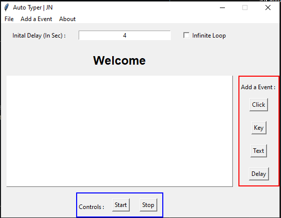

# AutoTyper - A Data Entry Tool 

There are many tools available online for automating stuff but almost all of them only provide trial versionsa and requires big payment for continued access. Even if they are free, it is not wise to give complete access to a keyboard to any third-party software. So I wrote this simple-short python script which can do some complicated stuff.

## Releases
https://github.com/ShaktiMan69/AutoTyper/releases

## Screenshot

